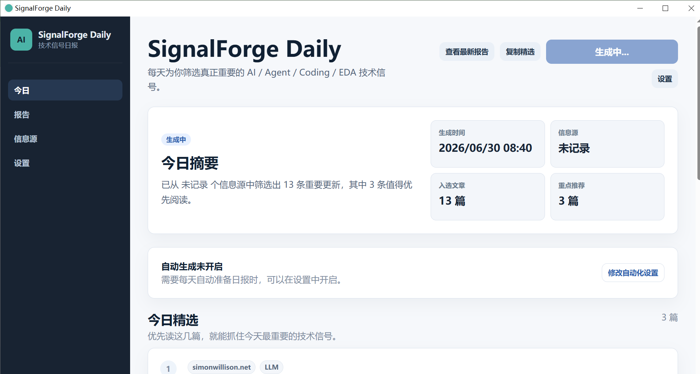

# SignalForge Daily

SignalForge Daily 是一个本地优先的技术信号日报桌面应用。它把 RSS / Blog 信息源、AI 摘要、来源质量、历史报告和自动生成习惯整合到一个 Tauri 桌面 App 中，重点服务 AI、Agent、Coding、EDA 和工程效率方向的信息跟踪。

当前版本：`v0.4.0`

## 产品截图



主界面展示今日 Top Picks、一键生成摘要、查看最新报告和系统托盘快捷操作入口。

## 核心功能

- First Run：首次启动进入配置流程，不要求用户手动改 `.env`。
- Digest Runner：一键调用现有 Python digest CLI，捕获 stdout / stderr，记录 RunRecord。
- Reports：历史 Markdown 报告列表与内置预览。
- Source Quality & Trust：启用 / 禁用 source，观察抓取、入选、失败和噪声源。
- Relevance Profile：配置关注主题、屏蔽主题和偏好内容类型。
- Feedback：对 Top Picks 记录有用、不感兴趣、隐藏类似。
- Automation：每天或工作日自动生成，支持通知、启动补跑和系统托盘菜单。
- Demo Mode：没有 API Key 时也能查看完整样例体验。
- About / Diagnostics：复制不含 secret 的诊断信息，打开 logs folder。

## 适合人群

- 每天需要追踪 AI / Agent / Coding 技术动态的工程师。
- 需要把 RSS 信息源逐步调成个人技术情报系统的用户。
- 希望报告、日志、运行记录都留在本地 workspace 的用户。
- 想试用本地优先桌面 AI 工具闭环的开发者。

## 安装方式

v0.4 优先支持 Windows x64 安装包。发布包生成后位于：

```text
app/src-tauri/target/release/bundle/nsis/*.exe
app/src-tauri/target/release/bundle/msi/*.msi
```

当前仓库不包含签名证书。未签名安装包可能触发 Windows SmartScreen，发布时需要在 Release Notes 中明确说明。

## 从源码运行

依赖：

- Python `>=3.10`
- `uv`
- Node.js + npm
- Rust + Windows C++ Build Tools

安装并启动开发版：

```bash
cd app
npm install
npm run tauri:dev
```

仅启动前端开发服务器：

```bash
cd app
npm run dev
```

## 配置 API Key

桌面 App 中进入 Settings，配置：

- Workspace folder
- API Key
- Base URL
- Model
- Proxy mode

CLI 使用时也可以通过环境变量提供：

```bash
export IFLOW_API_KEY=your_key
```

PowerShell：

```powershell
$env:IFLOW_API_KEY = "your_key"
```

不要提交 `.env`、API Key、token 或签名证书。

## 生成第一份日报

1. 首次启动选择 workspace。
2. 填写 AI Provider 配置。
3. 点击 Test Connection。
4. 进入 Today。
5. 点击 `生成今日摘要`。
6. 在 Top Picks 阅读推荐，并在 Reports 预览完整 Markdown。

没有 API Key 时，可在 Setup 页面点击 `进入 Demo Mode` 查看样例日报。

## 信息源质量管理

Sources 页面显示：

- 启用信息源数量
- 健康源
- 噪声较高源
- 最近失败源
- 每个 source 的抓取数、入选数、入选率、最近失败次数

用户可以启用 / 禁用 source，并添加新的 RSS / Blog / Custom source。

## 自动生成与通知

Settings 的 Automation 区域支持：

- 每天 / 工作日运行
- 指定运行时间
- 成功 / 失败通知
- 启动时补跑错过任务
- 今天已生成则跳过
- 暂停 / 恢复自动生成

系统托盘菜单包含打开应用、生成今日摘要、打开最新报告、查看信息源状态、暂停 / 恢复自动生成和退出。

## 本地数据与隐私

SignalForge Daily 是本地优先应用。用户选择的 workspace 会保存：

```text
app-config.json
runs/
reports/
logs/
metadata/
```

不会上传到 SignalForge Daily 自有服务器。AI Provider 会收到用于摘要和评分的文章标题、摘要、链接和相关 prompt。详见 [docs/privacy.md](docs/privacy.md)。

## 常见问题

详细故障排查见 [docs/troubleshooting.md](docs/troubleshooting.md)。

常见问题包括：

- API Key 未配置
- AI Provider 连接失败
- 代理错误
- 没有抓取到文章
- 部分信息源失败
- 通知权限未开启
- 自动生成没有触发
- Windows SmartScreen 提示

## 开发命令

```bash
cd app
npm run dev
npm run build
npm run tauri:dev
npm run tauri:build
npm run package
npm run sidecar:build
```

Python 验证：

```bash
uv run python -m pytest -q
uv run python -m signalforge_daily.digest_cli --help
```

Tauri shell 验证：

```bash
cd app/src-tauri
cargo test
cargo check
```

## 发布说明

发布前请执行：

- [docs/release-checklist.md](docs/release-checklist.md)
- [docs/smoke-test.md](docs/smoke-test.md)

构建 Windows 安装包：

```bash
cd app
npm run package
```

构建产物：

```text
app/src-tauri/target/release/bundle/nsis/
app/src-tauri/target/release/bundle/msi/
```

已知限制：

- 当前安装包未签名，可能触发 SmartScreen。
- 自动更新未实现，只提供 GitHub Releases 入口。
- 真实 digest、通知和托盘需要在交互式桌面环境中 smoke test。

## Roadmap

- v0.4 Packaging & Release：安装包、Demo Mode、About、诊断、文档。
- v0.5 Feedback Learning：让本地反馈逐步影响排序。
- v0.6 Source Marketplace：更好的源发现、导入和健康诊断。
- v0.7 Release Hardening：签名、自动更新、崩溃恢复和更完整的 installer QA。
